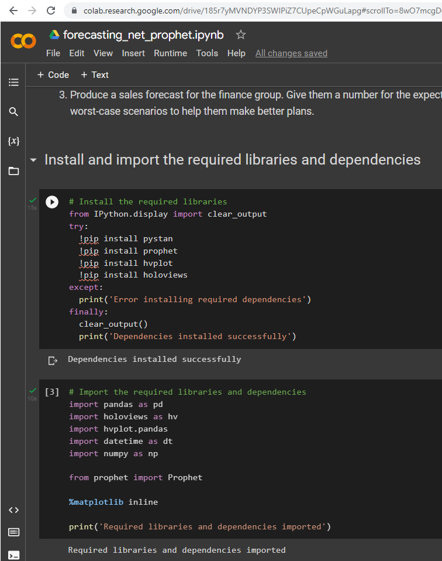
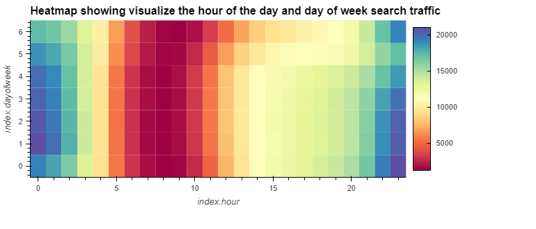
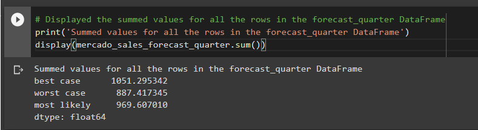

# Google Search Analyzer
Google Search Analyzer is a Jupyter Notebook based application which uses the Time Series Analysis technique to analyze the underlying data over the discrete time intervals and do forecasting for future revenue. The forecasting is done using an open source library [Prophet](https://facebook.github.io/prophet/). [MercadoLibre](https://mercadolibre.com/) google search and sales data is used in this project. Mercado Libre is the most popular e-commerce site in Latin America. The program analyzes the company's financial and user data in clever ways to make the company grow. The program finds out if the ability to predict search traffic can translate into the ability to successfully trade the stock.

The analysis is done in the following order.

* Step 1: Find unusual patterns in hourly Google search traffic
* Step 2: Mine the search traffic data for seasonality
* Step 3: Relate the search traffic to stock price patterns
* Step 4: Create a time series model with Prophet
* Step 5: Forecast revenue by using time series models

---

## Technologies

This project leverages Google Colab as a managed runtime hosted environment. Required Python libraries and dependencies can be installed in no time.
* [Google Colab](https://colab.research.google.com/) - Colab allows anybody to write and execute arbitrary python code through the browser, and is especially well suited to machine learning, data analysis and education.

**Required Libraries:**

You may need the following key libraries to work with the program.

- [Pandas](https://pandas.pydata.org/docs/reference/index.html) - pandas is a Python package providing fast, flexible, and expressive data structures designed to make working with “relational” or “labeled” data both easy and intuitive.
- [Prophet](https://facebook.github.io/prophet/) - Prophet is a procedure for forecasting time series data based on an additive model where non-linear trends are fit with yearly, weekly, and daily seasonality, plus holiday effects.
- [hvPlot](https://hvplot.holoviz.org/) - hvPlot provides a high-level plotting API built on HoloViews that provides a general and consistent API for plotting data in Python.

---

## Usage

To use the Google Search Analyzer application, clone the repository in your local workspace. Next, open [Google Colab](https://colab.research.google.com/) and upload **forecasting_net_prophet.ipynb**, which will load similar to a Jupyter Notebook web console. You may be prompted to upload csv files at three different stages. The CSV files are contained inside the Resource folder.

You may see the heatmap of hourly and days of week search trend as one such output of the analysis.

The forecast output using the Prophet library.

## Contributors

FinTech Labs, Inc.

---

## License

None
